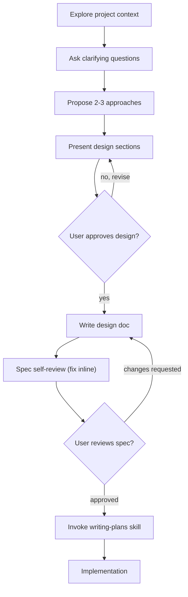

# Brainstorming — Ideas Into Designs

Turn ideas into fully formed designs and specs through structured collaborative dialogue.

**Start** by understanding project context, then ask questions one at a time to refine the idea. Once design is clear, present it and get user approval before any implementation.

> <HARD-GATE>
> Do NOT invoke any implementation skill, write any code, scaffold any project, or take any implementation action until you have presented a design and the user has approved it. This applies to EVERY project regardless of perceived simplicity.
> </HARD-GATE>

## Anti-Pattern: "This Is Too Simple To Need A Design"

Every project goes through this process. A todo list, a single-function utility, a config change — all of them. "Simple" projects are where unexamined assumptions cause the most wasted work. The design can be short (a few sentences for truly simple projects), but you MUST present it and get approval.

## Checklist

Complete these items **in order**:

1. **Explore project context** — check files, docs, recent commits. Use `search_files` and `read_file` to understand the codebase.
2. **Offer visual companion just-in-time** — NOT upfront. See Visual Companion section below.
3. **Ask clarifying questions** — one at a time, understand purpose / constraints / success criteria
4. **Propose 2-3 approaches** — with trade-offs and your recommendation
5. **Present design** — in sections scaled to their complexity, get user approval after each section
6. **Write design doc** — save to `.hermes/specs/YYYY-MM-DD-<topic>-design.md` and commit
7. **Spec self-review** — quick inline check for placeholders, contradictions, ambiguity, scope
8. **User reviews written spec** — ask user to review the spec file before proceeding
9. **Transition to implementation** — load `writing-plans` skill to create implementation plan

## Process Flow

**The terminal state is `writing-plans`.** Do NOT invoke any other implementation skill. The ONLY skill you invoke after brainstorming is `writing-plans`.

## The Process

### Understanding the idea
- Check out the current project state first (files, docs, recent commits)
- **Scope assessment:** If the request describes multiple independent subsystems, flag this immediately. Don't spend questions refining details of a project that needs to be decomposed first.
- **Decomposition:** If the project is too large for a single spec, help the user decompose into sub-projects. Each sub-project gets its own spec → plan → implementation cycle.
- For appropriately-scoped projects, ask questions **one at a time** to refine the idea
- **Prefer multiple choice questions** when possible, but open-ended is fine too
- Only one question per message
- Focus on understanding: purpose, constraints, success criteria

### Exploring approaches
- Propose **2-3 different approaches** with trade-offs
- Lead with your **recommended option** and explain why
- Present options conversationally

### Presenting the design
- Scale each section to its complexity: a few sentences if straightforward, up to 200-300 words if nuanced
- Ask after each section whether it looks right so far
- Cover: architecture, components, data flow, error handling, testing
- Be ready to go back and clarify if something doesn't make sense

### Design for isolation and clarity
- Break the system into smaller units that each have one clear purpose
- Communicate through well-defined interfaces
- Can someone understand what a unit does without reading its internals? If not, the boundaries need work.
- Smaller, well-bounded units are easier to reason about — when a file grows large, it's often doing too much.

### Working in existing codebases
- Explore the current structure before proposing changes. Follow existing patterns.
- Where existing code has problems that affect the work, include targeted improvements as part of the design.
- Don't propose unrelated refactoring. Stay focused on what serves the current goal.

## After the Design

### Documentation
- Write the validated design (spec) to `.hermes/specs/YYYY-MM-DD-<topic>-design.md`
- Commit the design document to git

### Spec Self-Review
After writing the spec document, look at it with fresh eyes:

1. **Placeholder scan:** Any "TBD", "TODO", incomplete sections, or vague requirements? Fix them.
2. **Internal consistency:** Do any sections contradict each other? Does the architecture match the feature descriptions?
3. **Scope check:** Is this focused enough for a single implementation plan, or does it need decomposition?
4. **Ambiguity check:** Could any requirement be interpreted two different ways? Pick one and make it explicit.

Fix any issues inline. No need to re-review — just fix and move on.

### User Review Gate
After the spec review loop passes, ask the user to review the written spec before proceeding:

> "Spec written and committed to `<path>`. Please review it and let me know if you want to make any changes before we start writing out the implementation plan."

Wait for the user's response. If they request changes, make them and re-run the spec review loop. Only proceed once the user approves.

### Implementation
- Load the `writing-plans` skill to create a detailed implementation plan
- Do NOT invoke any other skill. `writing-plans` is the next step.

## Key Principles

- **One question at a time** — Don't overwhelm with multiple questions
- **Multiple choice preferred** — Easier to answer than open-ended when possible
- **YAGNI ruthlessly** — Remove unnecessary features from all designs
- **Explore alternatives** — Always propose 2-3 approaches before settling
- **Incremental validation** — Present design, get approval before moving on
- **Be flexible** — Go back and clarify when something doesn't make sense

## Visual Companion (Browser)

A browser-based companion for showing mockups, diagrams, and visual options during brainstorming.

**Offering the companion (just-in-time):** Do NOT offer it upfront. Wait until a question would genuinely be clearer **shown than told** — a real mockup / layout / diagram question, not merely a UI *topic*. The first time that happens, offer it then, as its own message:

> "This next part might be easier if I show you — I can put together mockups, diagrams, and comparisons in a browser tab as we go. Want me to? I'll open it for you."

**This offer MUST be its own message.** Only the offer — no clarifying question, summary, or other content. Wait for the user's response.

**Per-question decision:** Even after the user accepts, decide for EACH QUESTION whether to use the browser or terminal. The test: **would the user understand this better by seeing it than reading it?**

- **Use the browser** for content that IS visual — mockups, wireframes, layout comparisons, architecture diagrams
- **Use the terminal** for content that is text — requirements questions, conceptual choices, tradeoff lists, scope decisions

## Integration

- Pair with `writing-plans` (this is the ONLY transition — terminal state)
- Pair with `test-driven-development` for implementation
- Pair with `subagent-driven-development` for multi-task execution
- Spec path `.hermes/specs/` can be overridden per user preference
